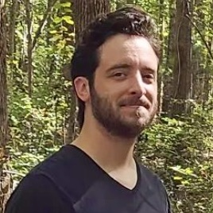

<section id="intro" class="greeting">
	

		

			

			
				

					<h1>{{ title }} he/him
					Product design & strategy</h1>
				

			

			
Designing experiences and strategy for mobile, desktop and web apps, learning to code, making playlists <a href="./playlists">playlists</a>, and cooking with butter.

		

	

</section>

<section>
	

		

			<h2>Reading</h2>
			
<em>Wintering</em>, by Katherine May

			
<a href="">Previous books</a>

		

		

			<h2>Listening</h2>
			<ul class="no-list-decor chrono-lists">
				<li>
				<h3 class="subheading">2022 spring</h3>
					<ul class="no-list-decor">
						<li><a href="https://music.apple.com/us/playlist/2022-spring/pl.u-LRdYmsBA2KX">Apple Music</a>
						
<a href="./playlists">Previous playlists</a>
</li>
					</ul>
				</li>
			</ul>
		

	

	

		

			<h2>Good finds</h2>
			<ul class="no-list-decor">
				<li>📚&nbsp;&nbsp;Cal Flyn's hopeful <a href="https://www.calflyn.com/nonfiction-books/islands-of-abandonment-nature-rebounding-post-human-landscape">Islands of Abandonment</a>, on natural biomes appearing in post-human landscapes</li>
				<li>🍱&nbsp;&nbsp;<a href="https://lifeandthyme.com">Life & Thyme's</a> illuminating journalism on the politics of food</li>
				<li>📸&nbsp;&nbsp;Thomas Murphy's <a href="https://therealmurphy.substack.com">Blood & Champagne</a>, a weekly palate cleanser compendium for the brain</li>
				<li>🐪&nbsp;&nbsp;The weird and marvelous <a href="https://vimeo.com/407941034">Bactrian camel</a> finally getting the love letter it deserves</li>
				<li>🐝&nbsp;&nbsp;A <a href="https://www.dwell.com/article/tecla-3d-printed-home-mario-cucinella-architects-wasp-28cde493">3D-printed concrete home</a> inspired by wasp nests, in Bologna, Italy</li>
			</ul>
		

	

</section>